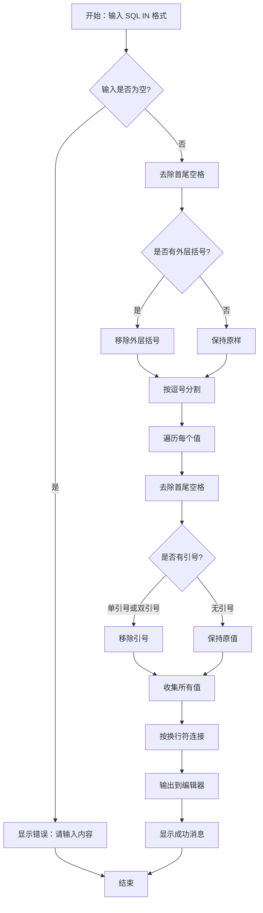
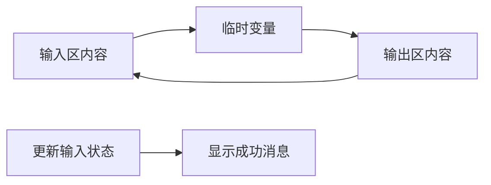
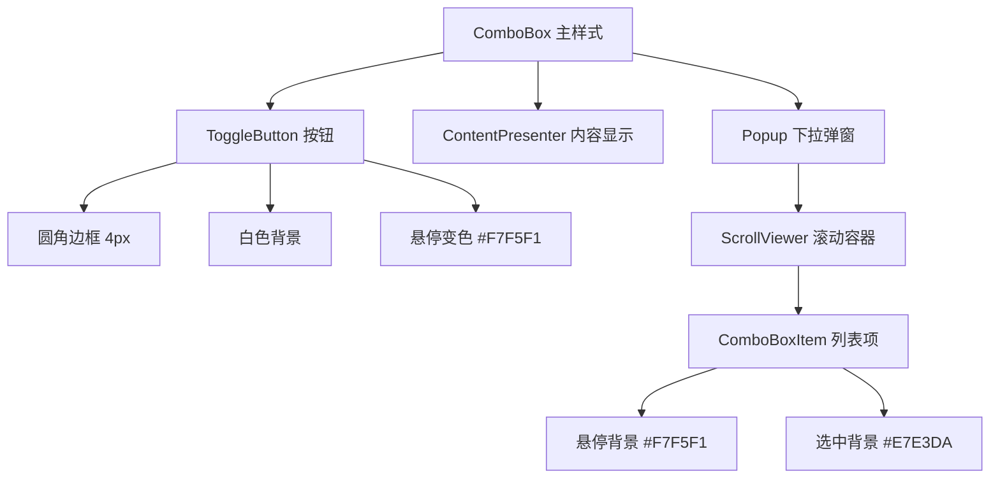

# SQL IN 工具修复说明

## 修复日期
2026年6月22日

## 问题描述

原 C# 项目的 SQL IN 工具存在以下问题：
1. **缺少去格式化功能**：只能将原始内容转换为 SQL IN 格式，但无法反向还原
2. **缺少交换按钮**：无法交换输入和输出区域的内容  
3. **样式问题**：ComboBox 下拉选择框的样式显示不正常

## 修复内容

### 1. 添加去格式化功能

#### 实现位置
`SqlInView.xaml.cs` - 新增 `UnformatFromSqlIn()` 方法

#### 功能说明
将 SQL IN 格式的数据还原为多行文本：
- 输入：`('你好', '1', '2', '3', '4', '5', '56', '66', '56')`
- 输出：
  ```
  你好
  1
  2
  3
  4
  5
  56
  66
  56
  ```

#### 处理逻辑


### 2. 添加交换功能

#### 实现位置
`SqlInView.xaml.cs` - 新增 `SwapInputOutput()` 方法

#### 功能说明
交换输入区域和输出区域的内容，方便用户在格式化和去格式化之间切换

#### 处理逻辑


### 3. 修复 ComboBox 样式

#### 实现位置
`SqlInView.xaml` - 自定义 ComboBox 的 ControlTemplate

#### 修复内容
- 自定义下拉按钮样式，使用圆角边框
- 统一背景色为白色 `#FFFFFF`
- 统一边框色为 `#E7E3DA`
- 添加鼠标悬停效果（背景变为 `#F7F5F1`）
- 自定义下拉箭头样式
- 自定义下拉列表项的悬停和选中样式

#### 样式特点


### 4. UI 布局调整

#### 按钮顺序（从左到右）
1. **引号类型选择** - ComboBox 下拉框
2. **格式化 (F4)** - 主要操作，蓝色按钮
3. **去格式化** - 次要操作，白色按钮
4. **交换** - 辅助操作，白色按钮
5. **复制 (Ctrl+Shift+C)** - 辅助操作，白色按钮
6. **清空** - 辅助操作，白色按钮

#### 按钮样式统一
- 主要操作（格式化）：蓝色背景 `#3C5A78`，悬停 `#2E4760`
- 次要操作（其他）：白色背景，边框 `#E7E3DA`，悬停 `#F7F5F1`
- 所有按钮：圆角 4px，高度 32px

## 预期测试用例

### 用例 1：格式化（多行转 SQL IN）
**输入**（每行一个值）：
```
你好
1
2
3
4
5
56
66
56
```

**输出**（单引号格式）：
```sql
('你好', '1', '2', '3', '4', '5', '56', '66', '56')
```

### 用例 2：去格式化（SQL IN 转多行）
**输入**（SQL IN 格式）：
```sql
('你好', '1', '2', '3', '4', '5', '56', '66', '56')
```

**输出**（多行）：
```
你好
1
2
3
4
5
56
66
56
```

### 用例 3：去格式化（无外层括号）
**输入**：
```sql
'value1', 'value2', 'value3'
```

**输出**：
```
value1
value2
value3
```

### 用例 4：去格式化（双引号格式）
**输入**：
```sql
("value1", "value2", "value3")
```

**输出**：
```
value1
value2
value3
```

### 用例 5：去格式化（无引号格式）
**输入**：
```sql
(123, 456, 789)
```

**输出**：
```
123
456
789
```

### 用例 6：交换功能
**初始状态**：
- 输入区：`hello\nworld`
- 输出区：`('hello', 'world')`

**点击交换后**：
- 输入区：`('hello', 'world')`
- 输出区：`hello\nworld`

### 用例 7：格式化 + 去格式化 + 交换（完整流程）
1. 输入区输入多行数据
2. 点击"格式化" → 输出区显示 SQL IN 格式
3. 点击"交换" → 输入区显示 SQL IN 格式，输出区显示原始多行
4. 点击"去格式化" → 输出区还原为多行格式

### 用例 8：引号类型切换
**输入区**：
```
test1
test2
```

**选择"单引号"后格式化**：
```sql
('test1', 'test2')
```

**选择"双引号"后格式化**：
```sql
("test1", "test2")
```

**选择"无引号"后格式化**：
```sql
(test1, test2)
```

### 用例 9：空输入处理
**输入区为空**：
- 点击"格式化" → 显示提示："请输入列表内容"
- 点击"去格式化" → 显示提示："请输入 SQL IN 格式内容"

### 用例 10：特殊字符处理（引号转义）
**输入区**（包含单引号）：
```
it's
test
```

**选择"单引号"后格式化**：
```sql
('it''s', 'test')
```

## 修改文件清单

1. `D:\code\my\1\dev_toolbox_c#\src\DevToolbox.Tools.Text\Views\SqlInView.xaml.cs`
   - 添加 `UnformatFromSqlIn()` 方法
   - 添加 `UnformatButton_Click()` 事件处理
   - 添加 `SwapInputOutput()` 方法
   - 添加 `SwapButton_Click()` 事件处理

2. `D:\code\my\1\dev_toolbox_c#\src\DevToolbox.Tools.Text\Views\SqlInView.xaml`
   - 自定义 ComboBox 样式模板
   - 添加"去格式化"按钮
   - 添加"交换"按钮
   - 调整按钮顺序和布局
   - 修改"转换"按钮文本为"格式化"

## 技术细节

### 去格式化算法
1. **移除外层括号**：判断首尾是否为 `()` 并移除
2. **分割逗号**：按 `,` 分割字符串
3. **去除引号**：判断是否被单引号或双引号包裹，如果是则移除
4. **过滤空值**：去除空白行
5. **拼接结果**：用换行符 `\n` 连接所有值

### ComboBox 样式关键点
- **ToggleButton**：控制下拉状态
- **ContentPresenter**：显示当前选中项
- **Popup**：下拉弹出层
- **ScrollViewer**：支持列表滚动
- **ComboBoxItem 样式**：统一列表项的悬停和选中效果

## 与老项目对比

| 功能 | 老项目（Flutter） | 新项目（C#/WPF） | 状态 |
|------|------------------|-----------------|------|
| 格式化 | ✅ 支持 | ✅ 支持 | 已实现 |
| 去格式化 | ✅ 支持 | ✅ 支持 | ✅ 已修复 |
| 交换 | ✅ 支持 | ✅ 支持 | ✅ 已修复 |
| 引号选择 | ❌ 不支持 | ✅ 支持 | 功能增强 |
| 样式美观 | ✅ 正常 | ✅ 正常 | ✅ 已修复 |

## 注意事项

1. **引号转义**：格式化时，如果输入内容包含引号，会自动转义（单引号 `'` → `''`）
2. **空行处理**：格式化和去格式化都会自动过滤空行
3. **首尾空格**：自动去除每个值的首尾空格
4. **快捷键**：格式化支持 F4 快捷键，复制支持 Ctrl+Shift+C

## 后续建议

1. 可以考虑添加"批量处理"功能，支持一次处理多个 SQL IN 语句
2. 可以添加"格式选项"，允许用户自定义输出格式（如是否换行、缩进等）
3. 可以添加"历史记录"功能，方便用户回溯之前的操作
